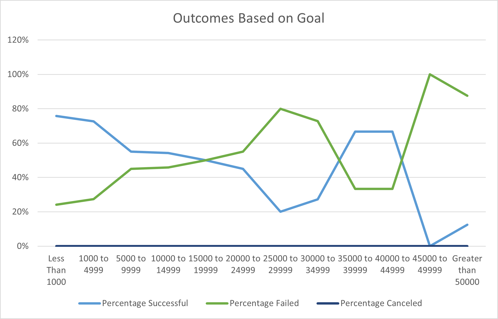

# An Analysis of Kickstarter Campaigns

---

## Overview of Project
Performing analysis on Kickstarter data to uncover trends.
### Purpose
The purpose of analyzing the supplied dataset is to determine Louise's best chance of success for her campaign. We are able to determine a practical goal for Louise's campaign to succeed, as well as the best timeframe for this campaign to take place from previous campaigns of similar nature.
## Analysis and Challenges

### Analysis of Outcomes Based on Launch Date
Theater campaigns are most successful in early summer months; May and June having the highest success rate. This could be due to higher likliness of summer travel in July/August due to the holidays. This time frame can also be more feasible for families to attend with the school year ending, and excitment at a high.
Theater campaigns are least successful in the Fall & Winter months. This could be caused due to the holiday season, giving potential theater goers a less than likely chance of visiting the theater unless it is a holiday themed campaign which has it's own set of limitations.

### Analysis of Outcomes Based on Goals
We can determine based on the data that the average pledged amount of successful productions was roughly $5,600 and exceeded the average goal of $5,050. A successful goal for Louise's kickstarter shouldn't exceed $5,000. As the average donation of successful US Kickstarter Plays is roughly $90, I would reccomend in her search for donations to have preset domination amounts in $50 increments.

### Challenges and Difficulties Encountered
While analyzing the data, I determined that there are some limitations that were encountered with the dataset were based on lack of demographic and marketing data. While we are able to determine the best timeframe for Louise's campaign, we are unable to determine exactly what demographic the successful productions were geared toward. Alongside this missing data, is the lack of marketing information. We are unsure of what marketing attempts were made, if any, for the more successful campaigns. If able to obtain this information, we can add additional summaries & charts to determine:
*Target demographic: Who is the target audience? Is it a family production, or geared toward an older audience?
*Marketing data: What efforts were attempted for marketing these campaigns to reach their goals, if any?
## Results

In conclusion, theater campaigns are most successful if planned in either May or June; June having a 65% success rate. Theater campaigns that are planned in Fall & Winter months are at a higher risk of failure; close to 50% of campaigns at that time of year are unable to proceed. In our findings we can determine that kickstarters for plays in the US are successful 76% of the time. In order for Louise to have the best chance for success is to have her Kickstarter have an obtainable $5,000 goal and in production during the right time of the year based on popularity.

